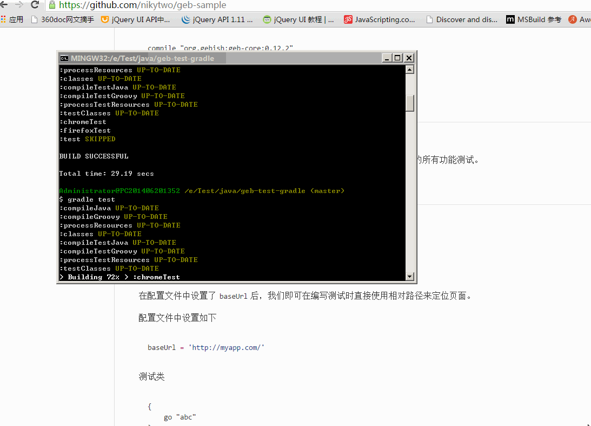

# Geb 简易文档

## 效果图




## 依赖及安装

* jdk1.7+
* gradle/maven (2选1)
* groovy2.3+

### jdk1.7 安装(略)

### gradle 安装

1 [下载](http://gradle.org/gradle-download/)

2 解压

3 设置环境变量：添加`GRADLE_HOME`环境变量指向解压包路径，将`GRADLE_HOME/bin`添加到`path`中。

4 测试安装是否成功：打开命令行，输入`gradle -v`

### maven 安装(略)

### groovy 安装

可以通过`gradle`的包管理功能自动进行安装，无需另外安装。如下代码：

```
compile "org.gebish:geb-core:0.12.2"
compile "org.seleniumhq.selenium:selenium-firefox-driver:2.45.0"
compile "org.seleniumhq.selenium:selenium-support:2.45.0"
```

## 运行测试

安装完依赖后，下载本示例项目。

在项目根目录中打开命令行窗口，然后输入`gradle test`，将运行项目下的所有功能测试。


## 使用

### 配置

`Geb`默认的配置文件名为`GebConfig.groovy`。

* baseUrl

在配置文件中设置了`baseUrl`后，我们即可在编写测试时直接使用相对路径来定位页面。

配置文件中设置如下
```groovy
baseUrl = 'http://myapp.com/'
```


测试类
```grooby
{
	go "abc"
}
```

则网址为：`http://myapp.com/abc`

* 浏览器支持

`WebDriver`默认支持`FireFox`，若要使用其他浏览器进行测试，需要下载相关的`driver`。
如`chrome`浏览器需要下载`chromedriver`(本项目已包含，不需要另外下载)。
更多内容请查看官方文档。


### API 语法参考

#### 常用

* `go`: 导航至指定页面

* `to`: 导航至`Page`类定义的页面

* `waitFor`: 等待页面响应

```groovy
// 等待页面标题等于某个值
waitFor { title == "Page Title" }

// 語法
waitFor {} // 預設的等待時間
waitFor(10) {} // 最長等待時間為 10 秒
waitFor(10, 0.5) {} // 最長等待時間為 10 秒，每次判斷條件的間隔時間為 0.5 秒
waitFor("quick") {} // 依照自定的等待時間
```
使用`waitFor`时，不要使用引用对象，若使用，则每次检查的都是同一个对象


#### Navigator API

在编写浏览器自动化测试时，需要大量的`DOM`操作，
幸好`Geb`提供了类似`jQuery`的选择器，让我们可以轻松的找到一个`DOM`。

* $() 方法

用法与`jQuery`类似

语法结构：

```groovy
$([css选择器], [index 或 range], [DOM 元素 attribute 或 text matchers])
```
如:

```groovy
$("div p", 0)
$("div p", title: "something")
$(0)
$(title: "something")

$("p", 0..1)*.text()
$("p", text: "p1").size()
$("p", text: "p1", class: "a").size()

// 正则表达式
$("p", text: ~/p./)
$("p", text: startsWith("p"))
$("p", text: endsWith("2"))
$("p", text: contains(~/\d/)).
```

`Geb`提供以下正则表达式方法

| 方法名 | 描述  |
|----------|---------|
| startsWith |       |
| contains |       |
| endsWith |       |
| containsWord |       |
| notStartsWith |       |
| notContains |       |
| notEndsWith |       |
| notContainsWord |       |

* 查找与过滤方法

```groovy
// 这两个是一样的
$("div").find(".b")
$("div").$(".b")

// 获取 class=b 的 div
$("div").filter(".b")

// 获取不包含 p 且 class=b 的 DOM
$(".b").not("p")

$("div").hasNot("p")
$("div").hasNot("input", type: "text")

// 获取包含 p 的 div
$("div").has("p")

$("div").has("input", type: "text")
```

* 遍历方法

```groovy
$("p.d").previous()
$("p.e").prevAll()
$("p.d").next()
$("p.c").nextAll()
$("p.d").parent()
$("p.c").siblings()
$("div.a").children()
```

* 模拟点击

```groovy
$("a.login").click()
```

* 大小与定位

```groovy
$("div").height == 20
$("div").width == 40
$("div").x == 20
$("div").y == 10
```

* Accessing tag name, attributes, text and classes

```html
<p title="a" class="a para">a</p>
<p title="b" class="b para">b</p>
<p title="c" class="c para">c</p>
```

```groovy
assert $("p").text() == "a"
assert $("p").tag() == "p"
assert $("p").@title == "a"
assert $("p").classes() == ["a", "para"]
```

* CSS 属性

```groovy
assert $("div").css("float") == "left"
```

* 模拟键盘输入

```groovy
// 模拟输入 foo
$("input") << "foo"
assert $("input").value() == "foo"

// 模拟输入 Ctrl+C
$("input") << Keys.chord(Keys.CONTROL, "c")

```

* 复杂交互

1 直接使用`WebDriver API`的`WebElement`

2 使用`Actions`类

```groovy
def actions = new Actions(driver)
WebElement someItem = $("li.clicky").firstElement()
def shiftClick = actions.keyDown(Keys.SHIFT).click(someItem).keyUp(Keys.SHIFT).build()
shiftClick.perform()
```

3 使用闭包

```groovy
interact {
    keyDown Keys.SHIFT
    click $("li.clicky")
    keyUp Keys.SHIFT
}
```

4 列子

拖放

```groovy
interact {
    clickAndHold($('#draggable'))
    moveByOffset(150, 200)
    release()
}
// 或者
interact {
    dragAndDropBy($("#draggable"), 150, 200)
}
// 或者
interact {
    dragAndDrop($("#draggable"), $("#droppable"))
}
```

Ctrl+单击

```groovy
import org.openqa.selenium.Keys

interact {
    keyDown(Keys.CONTROL)
    click($("ul.multiselect li", text: "Order 1"))
    click($("ul.multiselect li", text: "Order 2"))
    click($("ul.multiselect li", text: "Order 3"))
    keyUp(Keys.CONTROL)
}
```

滚动条
```groovy
Actions actions = new Actions(driver)
actions.moveToElement(driver.findElement(By.id('tab'))).perform()
// 或者
interact {
            clickAndHold($('#tab'))
            release()
}
// 或者
interact {
            click(theUI)
}
// 或者
interact {
            moveToElement(theUI)
}
// 或者使用 js (略)
```


### 操作 Frame

(略)


### 操作 javascript, AJAX 和 动态页面

(略)


### 处理下载

(略)


### Scripts and binding

(略)


### 测试报告

(略)


### 测试框架集成

(略)


### 其他

`Geb`可以通过继承`Page`类实现页面的重复使用。

通过继承`Module`类实现局部页面以便于重复使用。


**模拟点击`Alert()`**：

```java
driver.switchTo().alert().accept();
```

更多内容请参考官方文档


***

## 参考

* [Geb 官方文档](http://www.gebish.org/manual/current)
